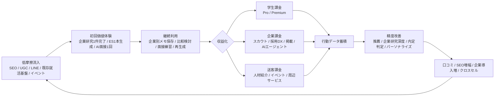

# 日本国内の就活向け企業研究AIサービス調査報告

## エグゼクティブサマリー

2026年6月22日時点で日本国内の就活向け企業研究AIサービスをみると、市場は大きく三つに分かれています。ひとつはワンキャリアAIやBaseMe AIのように、もともとの就活プラットフォームの中にAIを組み込み、企業探しからES/面接まで一気通貫で支援する型です。次に、内定くんAIやAI就活サポたくんのように、LINEを窓口にして低摩擦で使わせる型です。最後に、企業研究AIやES Makerのように、単機能を素早く使わせる専用ツール型です。公開情報ベースでは、学生向けを有料化しているサービスは少なく、多くは無料提供を前提に、企業向け採用支援や周辺の就職支援で収益化している構図が見えます。 citeturn20search0turn17search0turn42search1turn35search13turn22view0turn38search0

公開KPIは定義がまちまちですが、開示が比較的厚いのは内定くんAI、REALME、BaseMe、就活AI byジェイックです。内定くんAIは累計21万人以上の就活生利用とLINE友だち256,981人を掲げ、REALMEは累計約6万人登録、2027年卒の登録者数2万人を公表しています。BaseMeは2024年2月のリリース以来5万人超の登録ユーザーを公表し、ジェイックの就活AIは推計訪問者数255,592人、総利用回数601,770回を公表しています。一方で、MAUを明示したサービスは今回確認した範囲では見当たりませんでした。 citeturn42search1turn35search1turn9search4turn17search0turn21search1

事業モデルとしては、学生課金だけで大きく伸ばすのはかなり難しいです。理由は価格帯が低いためです。たとえば企業研究AIのProプランは780円、内定くんプレミアムは週払い自動更新ですが価格は未公開です。他方で、企業側の採用支援は新卒ダイレクトリクルーティングで成功報酬30万〜70万円程度、人材紹介では理論年収の35％程度が相場として示されており、B2B2C型のほうが高い獲得コストを耐えやすい構造です。したがって、今後の勝ち筋は「無料/低摩擦で学生を集める → 行動データを蓄積する → 企業向けのスカウト/採用DX/成功報酬で回収する」という流れになる可能性が高いです。 citeturn22view0turn35search4turn29search10turn30search1turn40search1

## 調査範囲と評価基準

今回の対象は、日本国内で提供される、新卒/既卒/第二新卒を含む就活向けAIサービスのうち、企業研究そのもの、または企業研究に直結する志望動機作成、業界分析、ES添削、面接対策を提供しているものです。純粋な求人媒体だけでAI支援がないものは除外し、逆に「企業研究専用」ではなくても、企業選びや企業理解にAIが直接関与しているサービスは対象に含めました。情報源は公式サイト、公式ニュース、公式プレスリリース、LINE公式アカウント、企業向け資料の公開ページを優先しました。未開示の事項は「未公開」と記載しています。なお、「主要競合」は各社の公開機能をもとにした機能重複ベースの推定です。 citeturn20search0turn17search0turn36search0turn42search1turn35search13turn10view2turn38search0

今回見えた大きな市場特徴は二つあります。ひとつは、学生向け価格の公開が薄いことです。無料で使わせるサービスが多く、学生課金を前面に出しているのは企業研究AIと内定くんAIくらいでした。もうひとつは、広く学生を集めるための導線が就活プラットフォーム、LINE、オウンドメディア、イベント/模試に集中していることです。つまり、AIそのものよりも「既に学生がいる場所」にどう差し込むかが成長の分岐点になっています。 citeturn22view0turn35search4turn20search0turn35search1turn43search4turn17search0

## サービス比較表

### 提供条件と機能の比較

| サービス名 | 運営会社 | 提供開始時期 | 料金プラン | 無料プランの利用制限 | 主要機能 | 参考出典 |
|---|---|---|---|---|---|---|
| 企業研究AI | 株式会社SHiRO | 未公開 / 少なくとも2025年時点で提供確認 | Proプラン 780円。クレジットカード決済。契約期間の定めなし。解約まで自動更新。更新周期は公開ページで未確認。無料枠の有無は示唆されるが詳細は未公開。 | 無料プランの回数/期間/機能制限は未公開 | 企業URL投入による企業情報自動調査 / 企業情報チャット / 企業研究効率化 | citeturn33search0turn22view0turn14search1 |
| ワンキャリアAI β版 | 株式会社ワンキャリア | 2026年4月 | 学生向け料金は未公開。ワンキャリアアプリ上のAI機能として提供。 | β版として提供。利用回数や機能制限は未公開。 | 自然言語での企業探し / 70万件超のクチコミ・企業情報・記事・動画をもとにした回答 / 企業選び / 選考対策 / ESブラッシュアップ | citeturn20search0turn19search0 |
| BaseMe AI | 株式会社ベースミー | BaseMeは2024年2月リリース / AI機能搭載は2024年7月 | 学生利用は無料。企業向け料金は要問い合わせ。 | 学生向けの回数制限や期間制限は未公開。 | 企業研究 / 自己分析 / ES作成添削 / 想定質問作成 / 価値観マッチングに基づく企業提案 | citeturn17search0turn37search9turn10view4turn37search5 |
| REALME | 株式会社ABABA | 2024年11月 | 学生向けは無料で利用できると公式記事で案内。企業向け料金は未公開。 | 学生向け回数制限や無料枠の詳細は未公開。 | AI面接 / 内定判定 / 14能力の数値化 / 自己分析 / ES支援 / 面接対策 / 志望企業の合格ライン到達者データ閲覧 | citeturn9search4turn36search0turn36search4turn9search12 |
| 内定くんAI | 株式会社内定くん | 2023年3月 | 無料版あり。プレミアムプランあり。プレミアムは週払いの自動更新だが価格は未公開。 | 無料版の詳細制限は未公開。 | ES添削 / ES作成 / 自己分析 / 企業分析 / AIマッチング / LINEでの就活支援 | citeturn42search5turn35search6turn35search4turn35search5 |
| AI就活サポたくん | 株式会社アローリンク | 2023年4月 | 無料で使い放題。有料プランは公開確認できず。 | LINE公式FAQではAI就活相談とES作成/添削が無料で使い放題。 | ES作成 / ES添削 / 面接対策 / メール作成 / 適性診断 / 就活相談 / 企業研究 | citeturn43search4turn35search13turn43search1 |
| 就活AI byジェイック | 株式会社ジェイック / 株式会社エフィシエント共同開発 | 2023年5月 | 無料 / 登録なしで利用可能 | 回数制限は公開確認できず。登録不要。 | 自己PR/ガクチカ作成添削 / 志望動機作成添削 / ES作成添削 / 逆質問 / 面接練習 / 自己分析 / 就活・転職相談 / 履歴書・職務経歴書作成 | citeturn10view2turn8search5turn21search1 |
| ES Maker | Ann株式会社 | 2023年3月 | 完全無料。会員登録不要で試用可。登録で無制限ES改善の導線あり。 | 登録不要で利用可能。会員登録で無制限ES改善。未登録時の厳密な回数制限は未公開。 | ES自動生成 / ES評価スコアリング / 企業分析 / 面接対策ボード / 自己分析ワークシート / プロフィール管理 | citeturn8search9turn38search0turn38search1turn22view1turn25search1 |

### 成長 / 収益化 / 差別化の比較

| サービス名 | 公開されているユーザー数 / MAU / 成長率 | ユーザー獲得チャネル | 収益化モデル | 差別化要因 | 主要競合 | 参考出典 |
|---|---|---|---|---|---|---|
| 企業研究AI | サービス単体のユーザー数 / MAUは未公開。SHiROは企業研究AIを含む4つの自社AI群をScoutLinkに連携し、ScoutLinkの月間新規登録者数は約2万人と公表。 | SHiROの就活AI群からの送客 / オウンドメディア「ココシロ」 / ScoutLink連携 / PR | B2Cサブスクが確認できる。加えてSHiRO全体ではB2Bスカウト事業と連動。 | URL投入だけで企業研究を完了させる専用性。 | ワンキャリアAI / BaseMe AI / ES Maker | citeturn15search0turn14search0turn14search1 |
| ワンキャリアAI β版 | AI機能単体のユーザー数 / MAUは未公開。母体のワンキャリアは約3人に2人の学生が利用、70万件超のクチコミ、1万社超の企業データを公表。 | 既存のワンキャリアアプリ / 就活イベント / ES/体験談UGC / SEO / 既存会員基盤 | 学生課金は未公開。企業向け採用DX / スカウト / 求人掲載 / イベント / 採用管理のエンゲージメント強化機能としての位置づけが濃い。 | 国内最大級の就活データ基盤を自然言語検索に転換した点。 | 企業研究AI / BaseMe AI / REALME | citeturn20search0turn20search1turn19search4 |
| BaseMe AI | BaseMeは2025年4月時点で15,000人超、2026年5月時点で50,000人超の登録ユーザー。約3.3倍に拡大。企業導入は150社超。 | 既存BaseMe基盤 / 企業導入先との共同拡大 / ウェビナー / イベント / PR | 学生側は無料。企業向けスカウト / 採用AIエージェント / 価値観データベース活用が主収益。 | 価値観マッチングとプロフィール連動AI。企業研究が「自分との相性」に寄る。 | ワンキャリアAI / REALME / 企業研究AI | citeturn17search3turn17search0turn41calculator0turn16search3turn37search4 |
| REALME | 2025年12月時点で累計約6万人登録。2027年卒登録者数2万人。 | ABABA既存基盤 / 全国一斉就活模試 / BeReal公式アカウント施策 / オウンドメディア / PR | 学生利用は無料色が強い。企業向けマッチング / 採用要件適合候補の送客 / 採用DXが主収益とみられる。 | AI面接で企業別の内定判定を返すこと。最終面接到達者データとの比較も独特。 | ワンキャリアAI / BaseMe AI / 内定くんAI | citeturn9search4turn9search15turn9search13turn9search9turn9search7 |
| 内定くんAI | 2023年6月3万人、2024年3月10万人、足元で累計21万人以上。LINE友だち256,981人。2024年3月時点で導入企業100社以上。 | LINE公式アカウント / 無料特典 / オウンドメディアSEO / スカウト機能 / PR | 学生向けプレミアム課金 / 企業向けAIマッチング / 成功報酬30万円プラン / 広告配信プラン | LINE完結の低摩擦UXと、B2C支援からB2Bスカウトまでの両輪。 | AI就活サポたくん / 就活AI byジェイック / REALME | citeturn42search0turn42search5turn42search1turn35search1turn42search7 |
| AI就活サポたくん | MAUは未公開。LINE友だち22,228人。 | LINE公式アカウント / キャリタス就活連携 / メディア掲載 / 採用DXソリューション群との連動 | 学生向けは無料。直接課金モデルは未公開。アローリンクの採用DX群とのシナジーが濃い。 | 無料使い放題と、LINE導線の軽さ。就活相談まで一気通貫。 | 内定くんAI / 就活AI byジェイック / ES Maker | citeturn35search13turn11search4turn43search4turn43search7 |
| 就活AI byジェイック | 2024年2月時点で総利用回数102,074回。2024年11月時点で401,268回。2025年8月時点で推計訪問者255,592人、総利用回数601,770回。 | 無料/登録不要のWeb流入 / ジェイック既存基盤 / Future Finder連携 / SEO / オウンドメディア / PR | 無料提供でリード獲得し、Future Finderや就職カレッジ等に送客。 | 登録不要の広い間口と、新卒だけでなく既卒/第二新卒まで含むこと。 | AI就活サポたくん / 内定くんAI / ES Maker | citeturn8search5turn21search4turn21search1turn21search5turn21search9 |
| ES Maker | 利用学生数15,000+、作成ES数50,000+、満足度95%。成長率は未公開。 | CareerMineの業界研究/ESメディアからのSEO流入 / 登録不要体験 / アプリストア導線 / オウンドメディア | 直接の学生課金は確認できず。周辺メディア/アプリ/人材サービスへの送客モデルの色が強い。 | 登録不要 / 完全無料で、企業分析や面接対策まで一画面に統合している点。 | 企業研究AI / 就活AI byジェイック / AI就活サポたくん | citeturn38search0turn22view1turn25search0turn25search1 |

公開KPIの比較では注意が必要です。累計登録者、LINE友だち数、総利用回数、推計訪問者数は定義が違うため、単純比較はできません。特に「ユーザー数が多い = 深く使われている」とは限らず、企業研究AIやワンキャリアAIのように、母体プラットフォーム内の1機能である場合はAI単体の深い利用指標が見えにくいです。逆に、LINE型は友だち追加が即KPIになるため、上位指標が見えやすい構造です。 citeturn20search0turn42search1turn35search13turn21search1

## サービス別の含意

まず、学生向けの「企業研究AI」と言っても、実際には二つの勝ち筋があります。ひとつはワンキャリアAIやBaseMe AIのように、既存データベースをAIインターフェースに変える方法です。この型は初回価値が高く、企業データ / クチコミ / プロフィール / 体験談が既にあるので、回答の精度と納得感を出しやすいです。もうひとつは内定くんAIやAI就活サポたくんのように、LINEで「とりあえず使う」体験を極端に軽くする方法です。こちらは獲得効率が高く、無料訴求や友だち追加特典と相性が良いです。 citeturn20search0turn17search0turn42search1turn35search13

次に、企業研究の深さでみると、最も専用性が高いのは企業研究AIです。URLを入れるだけで企業情報を自動調査し、チャットで深掘りできる設計は、他サービスよりも企業研究という単一課題に寄っています。一方で、最も「就活全体の文脈」で強いのはワンキャリアAI、BaseMe AI、REALMEです。企業研究がES、面接、スカウト、自己分析と連動しているため、単体ツールより離脱しにくいです。特にREALMEは、志望企業の内定判定と、合格ライン到達者の情報閲覧まで含むため、企業理解が選考突破の実務と直結しています。 citeturn33search0turn20search0turn17search0turn9search12turn36search0

収益構造でみると、学生課金だけを柱にしたモデルは弱く見えます。企業研究AIのProプランは780円で、Paddleが示すLTV:CACの一般目安3:1を当てると、仮に有料転換5％、有料LTVが3カ月分の2,340円でも、無料登録1件あたりの許容CACは約39円しかありません。つまり、学生課金だけでは広告を強く回しにくく、SEO、UGC、既存会員基盤、LINEのような低コストチャネルへの依存が必然になります。これに対して、企業向け成功報酬30万円のモデルで、無料登録からの monetized conversion を2％と置けば、許容CACは約2,000円になります。さらに、理論年収300万円に対する35％手数料なら1件105万円で、同じ2％転換でも許容CACは約7,000円まで上がります。ここが、B2B2C型が学生向けを無料にしやすい理由です。 citeturn22view0turn40search1turn44calculator0turn42search7turn30search1turn44calculator1turn44calculator3

## ユーザー獲得の有効施策と想定KPI

今回の調査対象を見比べると、最も効果が出やすいのは「既に就活生がいる場所」にAIを差し込む方法です。ワンキャリアAIは既存アプリと70万件超のクチコミを使い、BaseMe AIは既存プロフィールと価値観データを使い、内定くんAIとAI就活サポたくんはLINEを窓口にしています。つまり、このカテゴリでは新規にAIを売るより、既存就活行動の一部をAI化したほうが強いです。 citeturn20search0turn17search0turn42search1turn35search13

また、訴求メッセージは「AIで賢く就活」よりも「企業研究とESの時間を減らす」「面接前日に仕上がる」「登録不要ですぐ試せる」のほうが強いです。実際に、登録不要、無料、LINE送信だけ、URL入力だけといった低摩擦コピーを使っているサービスが多く、そこに企業研究や志望動機の実用価値をのせています。就活生は短期間で複数社を並行するため、抽象的なAI性能ではなく、時間短縮と企業別最適化が刺さりやすいと読めます。 citeturn10view2turn38search0turn33search0turn42search1

以下は、公開ベンチマークと各社の公開モデルをもとにした想定KPIです。数値は厳密な実測ではなく、SaaS / サブスク / 新卒採用の公開ベンチマークから逆算した推定レンジです。

| 施策 | この市場で効く理由 | 想定KPIレンジ | 推定ロジック / ベンチマーク |
|---|---|---|---|
| 既存プラットフォーム内送客 | 会員基盤が既にあり、AIが追加価値になる。最も摩擦が低い。 | 既存会員からAI初回利用への転換 10〜25% / 初回利用から週次継続 30〜50% / 増分CAC ほぼ0〜300円 | ワンキャリアは約3人に2人の学生が利用、BaseMeは5万人基盤。広告費よりプロダクト内導線改善が効く。 citeturn20search0turn17search0 |
| SEO / UGC / オウンドメディア | 就活は検索意図が強く、志望動機/業界研究/ESのキーワード需要が大きい。 | 記事流入から無料登録 4〜10% / 登録不要機能の初回利用 8〜15% / CAC 0〜800円 | SaaS landing pageの中央値は3.8%。就活の高意図流入と登録不要導線があるサービスはそれを上回りやすい。 citeturn27search11turn38search0turn25search0 |
| LINE / SNS短尺導線 | スマホ就活と相性が良く、登録フォームを省ける。 | 友だち追加後の初回利用 20〜50% / 登録学生CAC 300〜2,500円 / share率 5〜15% | LINE友だち導線は摩擦が低い。TikTok系CPIは1.75〜4ドルが目安で、足元の為替は1ドル160円前後なので、インストール単価は概ね280〜640円程度。そこから登録/初回利用の落ち率を掛けて上のレンジを置いた。 citeturn35search1turn35search13turn27search18turn39news17 |
| ウェビナー / 就活イベント / 模試 | 企業研究やAI活用法は学習コンテンツ化しやすく、濃い見込み客を作れる。 | 申込から参加 30〜60% / 参加から登録 20〜40% / CAC 1,500〜8,000円 | BaseMeの無料ウェビナー、REALMEの就活模試、ワンキャリアのイベントが示すように、深い利用に効く。SEOやLINEより単価は高いが、継続率は高くなりやすい。 citeturn37search4turn9search13turn19search4 |
| 大学提携 / 就活サービス提携 | 信頼性が高く、初期信用コストを下げやすい。 | 提携経由の登録率 10〜30% / CACは個別案件差が大きいが長期で低下 / LTVは高め | キャリタス就活連携のように、就活基盤と組むと認知コストを下げられる。短期CACより継続導線の質が重要。 citeturn11search4turn43search2 |

KPI設計で最も重要なのは、学生向け課金か、企業向け課金かで許容CACがまったく変わる点です。B2C課金単独なら、有料転換率は freemium で5％前後がひとつの基準で、LTV:CAC 3:1を守ろうとすると許容CACはかなり低くなります。他方、企業向け成功報酬は新卒ダイレクトリクルーティングで30万〜70万円、人材紹介で理論年収35％程度が相場で、新卒採用単価の平均も56.8万円です。つまり、このカテゴリでスケールする企業は、学生獲得そのものではなく、企業側のマネタイズ効率まで含めて獲得設計をする必要があります。 citeturn31search4turn31search20turn40search1turn29search10turn30search1turn30search7

## 成長モデルの仮説

この市場の成長モデルは、まず「低摩擦で試させる」ことが出発点です。企業研究AIのURL入力だけ、ES Makerの登録不要、内定くんAIとAI就活サポたくんのLINE導線、就活AI byジェイックの登録不要など、強いサービスは最初の一手がとても軽いです。就活は短期決戦なので、初回価値は10分以内に出ないと継続しにくいです。SaaSやサブスクのベンチマークでも、時間をかけて価値を理解させるより、短時間で価値に触れさせるほうが転換しやすい傾向があります。 citeturn33search0turn38search0turn35search1turn35search13turn10view2turn27search1

次に重要なのは、単発利用を「就活の作業台」に変えることです。企業別ノート保存、プロフィール連動、ES履歴、面接ログ、比較メモがあると、企業研究だけで終わらず、選考準備全体のハブになれます。就活AI byジェイックのノート機能、BaseMeのプロフィール連動、ES Makerのダッシュボード、REALMEのAI面接ログはこの方向にあります。ここまで来ると、データが溜まるほど推薦や企業研究の精度を上げられ、プロダクト自体が再訪理由になります。 citeturn21search2turn17search2turn22view1turn9search7

最後に、売上の本命は学生課金より企業課金です。学生課金は継続期間が短く価格も低いので、広告依存の成長は難しいです。逆に、企業向けスカウト、採用要件マッチング、成功報酬、人材紹介、採用DXに接続すると、1件あたり売上が大きくなり、学生向けは無料のままでも回せます。今回の対象群でも、BaseMe、REALME、内定くんAI、ワンキャリアAIはこの構造と親和性が高いです。したがって、中長期で最も伸びやすいのは、企業研究機能を単体で終わらせず、「学生の本音データ」と「企業の採用要件」をつなぐプロダクト群に育てられる会社だと考えられます。 citeturn16search3turn9search7turn42search7turn20search1turn14search0

## 総括

現時点での市場評価をまとめると、専用性で最もわかりやすいのは企業研究AI、データ量で最も強いのはワンキャリアAI、価値観マッチングで差別化しているのがBaseMe AI、選考実務への直結度が高いのがREALME、獲得効率の強さが目立つのが内定くんAIとAI就活サポたくん、間口の広さで優れるのが就活AI byジェイック、登録不要の完成度で目立つのがES Makerです。 citeturn33search0turn20search0turn17search0turn36search0turn42search1turn35search13turn10view2turn38search0

投資家目線 / 事業開発目線では、今後の勝敗を分けるのは三点です。ひとつめは、企業研究を単発の回答で終わらせず、比較 / 保存 / 志望動機 / 面接に接続できるかです。ふたつめは、無料で集めた学生行動データを企業課金に変えられるかです。みっつめは、SEO / LINE / 既存会員基盤のような低CACチャネルを自前で持てるかです。逆に、学生向けの低価格サブスクだけに依存するモデルは、獲得コストの面でかなり厳しいとみるのが妥当です。 citeturn22view0turn40search1turn44calculator0turn44calculator1turn44calculator3