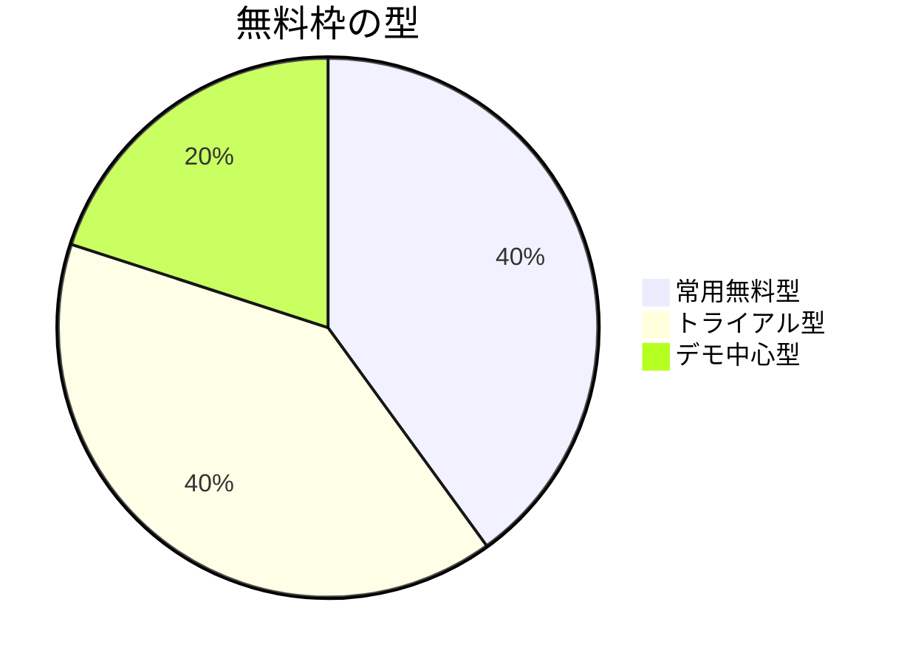

# 日本国内のAI面接サービス料金調査

## エグゼクティブサマリ

日本国内で現在確認しやすいAI面接サービスは、企業向けSaaSと個人向け模擬面接ツールに大きく分かれていました。公開価格がはっきりしている企業向けサービスは SHaiN / Our AI面接 / MiAI / AI RECOMEN など一部で、PeopleX / harutaka / CaseMatch企業向けは見積もり前提でした。 citeturn44search1turn39search6turn46view0turn41view0turn50search1turn18search4turn38view0

無料枠の中身はかなり差がありました。実質的に常用しやすい無料サービスは REALME / ユーザーローカル就活面接練習AI / CaseMatch / カチメン無料版で、企業向けは無料デモや期間限定トライアルが中心でした。 citeturn25search3turn26search3turn15view1turn15view2turn23view0turn27search0turn20search3turn18search1turn21search1turn31search2turn30search3

無料のお試し回数や期間を明示していたのは、harutakaの14日間 / 応募者100名まで、AI RECOMENの1週間程度 / 面接最大10回、カチメンの初回1週間無料トライアルなどでした。SHaiN / PeopleX / MiAI / Our AI面接は無料枠の存在は確認できましたが、回数上限の明示は弱めでした。 citeturn18search1turn18search5turn41view0turn42view1turn23view0turn31search2turn27search0turn20search3turn30search3

企業導入で料金だけを見ると、低コストの入口は AI RECOMEN の回数パックと SHaiN の従量課金が見やすく、件数変動が大きい採用では Our AI面接 の定額制が比較しやすい構図でした。個人利用では REALME と User Local が無料で入りやすく、カチメンは低額サブスクで機能開放する形でした。 citeturn41view0turn44search1turn39search6turn25search3turn15view1turn23view0

## 調査範囲と確認方法

今回の対象は、日本国内で提供されている主要なAI面接サービス10件です。企業向けの一次面接自動化 / 録画面接 / 面接評価支援に加えて、個人向けの模擬面接サービスも含めました。無料プランや無料トライアルの回数 / 期間が公式ページで明示されていない場合は 未記載 としています。

確認の優先順位は次の通りです。

- 公式サービスページ / 公式料金ページ / 公式FAQ
- 公式プレスリリース / 公式利用規約 / 公式会社概要
- 公式が配布した製品資料や展示会掲載PDF
- 補助情報として主要メディア記事

AI RECOMEN の料金だけは、公式サイト本体で細かな価格表を読み切れなかったため、公式サイトに加えて展示会掲載の製品PDFを補助情報として使いました。 citeturn21search0turn41view0turn42view0turn42view1

## 比較表

注記として、無料お試し回数は 公式に明示された回数 / 期間 を優先して記載しています。明示がないものは 未記載 としました。

| 企業名 | サービス名 | 無料の有無 | 無料お試し回数 | 無料の制限 | 有料価格帯 | 導入形態 | 追加費用 | 契約条件 | 情報ソースURL | 情報取得日 |
|---|---|---|---|---|---|---|---|---|---|---|
| JetB株式会社 | Our AI面接 | あり | 1か月無料トライアル / 回数上限は未記載 | 企業向けトライアル。詳細条件は個別確認 | 月額75,000円から | 企業向け / クラウドSaaS / ブラウザ | 初期費用あり / オプションあり / 従量課金なし | 契約期間1年 / 解約条件は公開FAQで未記載 | `https://ai-mensetsu.jp/faq/` / `https://ai-mensetsu.jp/introduction/point/` / `https://ai-mensetsu.jp/privacypolicy/` citeturn39search6turn30search0turn30search3turn39search5turn39search7 | 2026-06-22 |
| 株式会社タレントアンドアセスメント | SHaiN | あり | 無料トライアルあり / 件数と期間に制限あり / 詳細回数は未記載 | 本格導入前の検証用。件数上限と期間の詳細は公開ページで読めず | 標準プラン 5,000円/件。年間利用10件以上 | 企業向け / クラウドSaaS / スマホ受検 | 初期費用の公開額は未記載 | 年間利用10件以上 / 有効期限1年。約款上はユーザー削除申出時に未払い利用料金全額の支払い記載あり | `https://shain-ai.jp/fee/` / `https://shain-ai.jp/faq-company/` / `https://shain-ai.jp/about/` citeturn44search1turn31search2turn10search4turn48search1turn29search0 | 2026-06-22 |
| 株式会社PeopleX | PeopleX AI面接 | あり | 無料で試してみる と記載 / 回数と期間は未記載 | 実機能体験。詳細条件は公開ページで未記載 | 初期費用 + 月額料金 + 従量料金。金額は未公開 | 企業向け / クラウドSaaS | 付帯機能に応じて月額変動 | 商談から最短5営業日程度で開始。契約期間 / 解約条件は未記載 | `https://peoplex.jp/ai-interview/` citeturn50search1turn27search0turn50search0 | 2026-06-22 |
| 株式会社ZENKIGEN | harutaka AI面接 | あり | 14日間 / 応募者登録100名まで / 面接回数制限なし | 無料トライアルは応募者数で上限管理 | 初期費用 + 月額費用。金額は見積もり | 企業向け / クラウドSaaS | 面接設計 / 導入支援の初期費用 | 導入まで最短1週間程度。解約条件は未記載 | `https://harutaka.jp/trial` / `https://harutaka.jp/price` / `https://harutaka.jp/ai-interview` citeturn18search1turn18search5turn18search4turn18search0 | 2026-06-22 |
| プロップス株式会社 | MiAI | あり | 無料デモあり / 回数と期間は未記載 | デモ中心。実運用の無料回数は未記載 | 1面接1,000円から。初期費用なし + 月額基本料 + 従量課金 | 企業向け / クラウドSaaS | 月額基本料 / 従量課金 | 最短即日導入。契約期間 / 解約条件は未記載 | `https://lp.miai-app.com/` / `https://lp.miai-app.com/media/benefits/ai-interview-instant-setup.html` citeturn46view0turn20search3turn20search10 | 2026-06-22 |
| 株式会社アイエンター | AI RECOMEN | あり | 1週間程度のトライアル / デモアカウント最大2週間 / 面接最大10回 | 初回打合せ後にデモ発行。回数 / 期間とも明示あり | 半年パック 35,000円/50回, 68,000円/100回, 198,000円/300回, 320,000円/500回, 600,000円/1,000回 | 企業向け / クラウドSaaS / 録画型AI面接 | 初期費用なし / 月額固定なし / 上限到達時は追加購入 | 半年間で消費。未消化分は持ち越し不可 | `https://service.recomen.ai/` / `https://service.recomen.ai/demo/` / 補助 `https://pub-mediabox-storage.rxweb-prd.com/.../87207956-3e58-428d-9e9c-30f0d95a165d.pdf` citeturn21search0turn21search1turn41view0turn42view0turn42view1 | 2026-06-22 |
| 株式会社ABABA | REALME | あり | 無料。公式記事では AI面接を何度でも実施可能 と案内 | 個人向け就活対策サービス。企業向け採用SaaSとは別文脈 | 公開有料プランを確認できず | 個人向け / Webサービス | 公開サイトで確認できず | 課金契約条件は公開サイトで確認できず | `https://hr.realme.jp/` / `https://hr.ababa.co.jp/article/interview-prep/interview-practice-how-many/` citeturn49search0turn49search3turn26search3turn26search6 | 2026-06-22 |
| 株式会社ユーザーローカル | ユーザーローカル就活面接練習AI | あり | 無料公開 / 回数と期間は未記載 | 個人向け公開ツール。機能制限の公開記述は見当たらず | 公開有料プランを確認できず | 個人向け / Webツール | 公開記載なし | 公開記載なし | `https://ai-tool.userlocal.jp/interview_ai` / `https://www.userlocal.jp/press/20250901ma/` citeturn15view1turn35search0 | 2026-06-22 |
| CaseMatch株式会社 | CaseMatch | あり | 個人向け基本機能は無料 / 回数制限は未記載 | 面接練習 / フィードバック確認 / スカウト受信が無料。企業向けは別料金体系 | 企業向けAI面接は初期費用 + 月額 + 従量課金。月額には年間50回分の面接費用を含むが金額は未公開 | 個人向けWeb + 企業向けSaaS | 企業向けは従量課金あり | 企業向けは打合せから最短5営業日。企業向け解約条件は未記載 | `https://casematch.jp/` / `https://biz.casematch.jp/service/ai_interview` / `https://biz.casematch.jp/company` citeturn15view2turn38view0turn37view0turn15view3 | 2026-06-22 |
| 株式会社CAC identity | カチメン！ | あり | 基本機能は無料 / プレミアムは初回1週間無料トライアル | 無料版は一部機能のみ。詳細スコア閲覧 / 自己紹介以外の模擬面接 / 動画分析 / 話す練習はプレミアム | 600円/月, 1,500円/3か月, 3,000円/6か月, 6,000円/12か月 | 個人向け / モバイルアプリ / App内課金 | アプリ内課金サブスク | 解約はApp Store / Google Play側で実施。アプリ内解約不可 | `https://kachimen.jp/faq` / `https://kachimen.jp/transactions_law` citeturn23view0turn23view1turn34search1turn34search5 | 2026-06-22 |

## 傾向の整理

無料枠の設計は大きく3つに分かれていました。常用無料型は REALME / ユーザーローカル就活面接練習AI / CaseMatch / カチメン無料版、トライアル型は Our AI面接 / SHaiN / harutaka / AI RECOMEN、デモ中心型は PeopleX / MiAI です。企業向けでは、導入前の個別商談を前提にした 無料デモ の比率が高いのが特徴でした。 citeturn25search3turn26search3turn15view1turn15view2turn23view0turn30search3turn31search2turn18search1turn42view1turn27search0turn20search3

価格公開の透明性は、まだ高いとは言えませんでした。企業向けで比較しやすい価格が公開されていたのは SHaiN の従量課金、Our AI面接 の月額定額、MiAI の面接単価、AI RECOMEN の回数パックです。一方で PeopleX / harutaka / CaseMatch企業向けは、料金方式までは見えるものの、実額は見積もり前提でした。 citeturn44search1turn39search6turn46view0turn41view0turn50search1turn18search4turn38view0

無料のお試し回数まで明示していたサービスは少数でした。特に使いやすさが分かりやすかったのは、harutaka の 14日 / 応募者100名、AI RECOMEN の 1週間程度 / 最大10回、カチメン の初回1週間です。逆に SHaiN / PeopleX / MiAI / Our AI面接 は、無料枠の存在は確認できるものの、回数や期間の細部は問い合わせ前提でした。 citeturn18search1turn18search5turn42view1turn23view0turn31search2turn27search0turn20search3turn30search3

個人向けと企業向けでは、料金の考え方もかなり違います。個人向けは 無料で何度も試す / 低額サブスクで機能開放 という設計が多く、企業向けは 面接件数 / 月額固定 / 機能カスタマイズ / サポート体制 を含めて個別見積もりに寄る傾向が強いです。 citeturn26search3turn15view1turn15view2turn23view0turn50search1turn18search0turn46view0turn38view0

## 各社の詳細

- JetB株式会社 / Our AI面接
  定額制が明確で、公開FAQでは 月額75,000円から、面接件数は無制限、初期費用あり、契約期間は1年と案内されています。直近の公式記事では 1か月無料トライアル 実施中とされており、応募数の変動が大きい採用で費用を読みやすいタイプです。 citeturn39search6turn30search0turn30search3turn39search7

- 株式会社タレントアンドアセスメント / SHaiN
  公式の料金ページ検索結果では 標準プラン 5,000円/件 が確認でき、FAQでは 年間利用10件以上 / 有効期限1年 とされています。無料トライアルはあるものの、件数 / 期間の細かい条件は公開検索だけでは読み切れませんでした。企業向けの従量課金サービスとしては、入口価格の把握は比較的しやすいです。 citeturn44search1turn10search4turn31search2turn48search1turn29search0

- 株式会社PeopleX / PeopleX AI面接
  料金体系は 初期費用 / 月額費用 / 従量料金 の3本立てで、月額は付帯機能に応じて変動します。公開額は出ていませんが、無料で試してみる 導線があり、商談から最短5営業日で開始できる点は明確です。大手企業導入事例が多く、候補者体験を重視する設計が前面に出ています。 citeturn50search1turn27search0turn5view0

- 株式会社ZENKIGEN / harutaka AI面接
  無料トライアルの条件がかなり具体的で、14日間 / 応募者100名まで / 面接回数制限なし と明示されています。有料は 面接設計 / 導入支援の初期費用 と 月額費用 の構成で、金額は見積もりです。まず実運用に近い形で試したい企業には、無料枠の分かりやすさが強みです。 citeturn18search1turn18search5turn18search0turn18search4

- プロップス株式会社 / MiAI
  公式トップでは 1面接1,000円から と明示され、別の公式記事では 初期費用なし / 月額基本料 + 従量課金 のハイブリッド型と説明されています。無料デモ体験があり、導入は最短即日です。企業ごとの質問設計や評価軸を細かく作り込みたい会社向けの色が強いです。 citeturn46view0turn20search10turn20search3

- 株式会社アイエンター / AI RECOMEN
  公式サイト本体では 無料デモ を案内しつつ、補助資料の公式製品PDFでは 50回35,000円 / 100回68,000円 / 300回198,000円 などの半年パックが確認できます。同PDFでは 初期費用なし / 月額固定なし、未消化分は持ち越し不可、トライアルは1週間程度 / 最大10回 と明示されています。件数がそこまで多くない会社には、かなり比較しやすい価格体系です。 citeturn21search0turn21search1turn41view0turn42view0turn42view1

- 株式会社ABABA / REALME
  個人向けの就活AI面接としては、無料で始めやすい代表例です。公式記事では 無料でAI面接が行える と案内され、別の公式記事では AI面接は何度でも実施可能 と記載されています。公開有料プランは確認できず、課金前提ではなく常用無料に近い位置づけでした。 citeturn25search3turn25search8turn26search3turn49search3

- 株式会社ユーザーローカル / ユーザーローカル就活面接練習AI
  2025年9月の公式プレスリリースで 無料で提供開始 と明記されています。AIアバターとの模擬面接と、話し方 / 会話内容の評価レポート作成が中心です。現時点で公開有料プランや無料回数上限は確認できませんでした。まず無料で軽く試したい個人には入りやすいです。 citeturn15view1turn35search0

- CaseMatch株式会社 / CaseMatch
  個人向けトップでは 学生 / 社会人ともに基本機能はすべて無料 とされ、面接練習 / フィードバック / スカウト受信に追加費用はかからないと案内されています。一方、企業向けの CaseMatch AI面接 は 初期費用 / 月額料金 / 従量課金 の構成で、月額には年間50回分の面接費用を含むものの実額は非公開です。個人無料と企業課金の二層構造が分かりやすいサービスです。 citeturn15view2turn38view0turn37view0

- 株式会社CAC identity / カチメン！
  無料ダウンロード可能で、基本利用は無料です。ただし、詳細スコア閲覧や 自己紹介以外の模擬面接、動画分析、話す練習 などはプレミアム対象です。価格は 600円/月 / 1,500円/3か月 / 3,000円/6か月 / 6,000円/12か月、初回は 1週間無料トライアル、解約はストア側で行い、アプリ内では解約できません。個人向けでは、いちばん料金が読みやすい部類です。 citeturn23view0turn23view1turn34search1turn34search5

## 考察と推奨

導入検討でまず気をつけたいのは、無料 の言葉の意味です。企業向けでは、無料プランというより 無料デモ / 無料トライアル の意味で使われているケースが多く、実運用に近い件数まで無償で回せるかどうかは別問題です。無料枠の中身が比較的はっきりしていたのは harutaka / AI RECOMEN / カチメン でした。 citeturn18search1turn42view1turn23view0

次に見るべきは、価格の単位です。SHaiN のような従量課金は少数採用で相性がよく、Our AI面接 の定額制は応募数が読みにくい大量採用に向きやすいです。AI RECOMEN のような回数パックは、中間的な採用規模で予算管理しやすい設計です。 citeturn44search1turn39search6turn41view0

個人利用なら、まずは無料常用型を優先するのが失敗しにくいです。REALME / ユーザーローカル / CaseMatch は課金前提でなく入りやすく、Kachimen は有料でも月額が小さいので、表情や話し方の改善までやりたい人に向いています。 citeturn26search3turn15view1turn15view2turn23view0

企業導入で最後に確認すべき実務ポイントは次の4つです。

- 無料枠で 何人まで / 何回まで / 何日まで 試せるか
- 面接単価だけでなく 初期費用 / オプション / 従量超過 / 未消化失効 の有無
- ATS連携やCSV出力の可否
- 契約期間と中途解約の条件が公開資料で読めるか

この4点まで事前に揃っているサービスは、今回の対象では harutaka / AI RECOMEN / カチメン が相対的に確認しやすく、逆に PeopleX / MiAI / SHaiN / CaseMatch企業向けは、最終的に営業ヒアリングで詰める前提が強いと見ておくのが安全です。 citeturn18search1turn18search4turn41view0turn42view1turn23view0turn50search1turn46view0turn10search4turn38view0