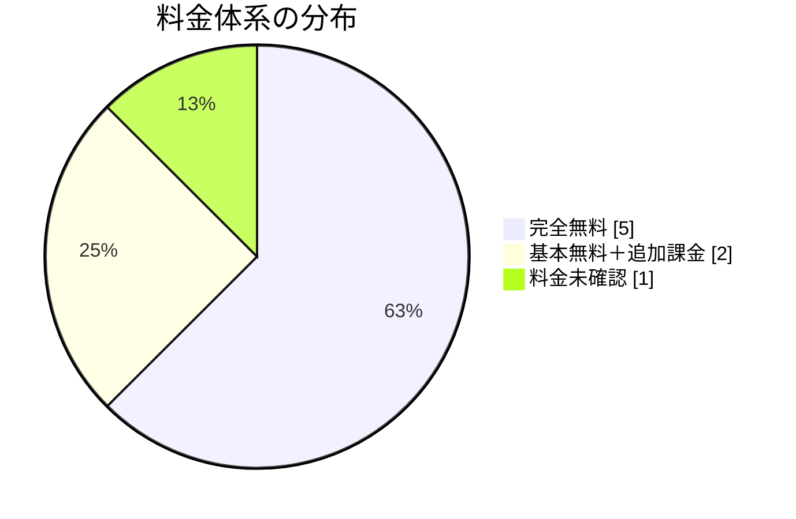

# 日本国内のAI履歴書添削サービスの料金調査

## エグゼクティブサマリー

2026年6月22日時点で公開情報を確認できた国内主要サービスを見ると、求職者向けの料金は無料寄りです。明示的な有料課金が確認できたのは、HelloBossのコンビニ印刷 500円/1ファイルと、yagishのヤギプライム 550円/30日が中心で、他は全機能無料または料金未確認でした。 citeturn29view0turn2view4turn17search0turn17search1turn8view0turn12search2turn19view3turn1search6

無料プランの回数制限は、各社で開示の粒度に差があります。HelloBossは無料で何度でも利用可能と明記し、yagishは無料会員のAI文章作成が少なくとも一部導線で1日1回、ヤギプライムではAI文章作成1日5回までと読める公開情報があります。一方、RESUMY.AI / MYレジュメ / 就活AI / GradsGuide / ととのう応募書類は、無料自体は明示していても、回数上限までは公式に詳しく書いていないケースが多いです。 citeturn29view0turn15search10turn15search0turn1search6turn8view0turn3view0turn12search2turn19view3

なお、市場全体では、厳密な意味での添削AIよりも、職務要約や自己PRを作るAI、標準フォーマットへ整えるAI、面接対策までまとめて提供するAIのほうが多いです。アップロード済みの履歴書/職務経歴書を評価軸付きでレビューするタイプは、今回の調査範囲ではGradsGuideが最も明確でした。 citeturn12search2turn29view0turn19view3turn3view0turn20search0turn8view0

## 比較表

注記として、URL欄は見やすさのためにドメイン/パス表記にしています。未確認は、今回確認できた公式サイト/公式発表/規約で明示を見つけられなかった項目です。

| サービス名 | 運営会社 | 公式サイトURL | 料金プラン | 無料プランの有無 | 無料プランでの試用回数 / 制限 | 追加費用や制約 | AIの機能 | 更新日と情報ソース |
|---|---|---|---|---|---|---|---|---|
| HelloBoss AI履歴書/職務経歴書 | 株式会社NGA | `helloboss.com/resume` | 基本機能は無料。コンビニ印刷は 500円/1ファイル。1ファイルは日本語履歴書 / 英語履歴書 / 職務経歴書 / 履歴書写真の各単位で、書類は10ページ以内。 citeturn29view0turn2view4 | あり。 citeturn7view1turn29view0 | 何度でも利用可能。保存、編集、再ダウンロードも可能。 citeturn29view0turn7view1 | 印刷だけは有料。印刷時はQRコード経由。 citeturn2view4 | 職務要約AI自動作成 / STAR式職務経歴の自動整理 / スキル提案 / 自己PR作成 / 英文レジュメ変換 / 求人ごとの自動最適化 / AI履歴書写真。 citeturn29view0turn2view4 | 2026-03-12、2026-04-02の公式PRと公式FAQを確認。 citeturn29view0turn2view4turn7view1 |
| RESUMY.AI | 株式会社Chott | `www.resumy.ai` | 料金は一切かからず、全機能無料。 citeturn1search6 | ありというより、実質は全機能無料。 citeturn1search6 | 回数上限の明記は未確認。公式では無料の明示まで確認。 citeturn1search6 | 追加費用は未指定。 citeturn1search6 | 生成AIによる文章生成 / 豊富な例文を使った履歴書・職務経歴書作成 / 退職願作成支援。 citeturn20search0turn22search13 | 公式トップは日付未記載。運営会社は特商法表記と会社サイトで確認。 citeturn22search1turn22search2 |
| MYレジュメ | 株式会社MUSUBU | `myresume-ai.jp` | 会員登録、履歴書作成、保存/編集、PDF/Wordダウンロード、AI文章生成、AI証明写真合成まで無料。 citeturn8view0 | あり。 citeturn8view0 | 公式に回数制限の明記なし。履歴書作成は登録不要で利用可。より多機能利用はログイン推奨。 citeturn8view0 | 追加費用の公開記載なし。無料キャリア相談への導線あり。 citeturn8view0turn28search0 | 業務内容 / 職務要約のAI考案、AI文章生成、写真合成AIでスーツ着せ替え / 美肌設定。 citeturn8view0 | ヘルプページ日付未記載。運営会社情報は企業情報ページで確認。 citeturn8view0turn28search0 |
| yagish / ヤギッシュ | 株式会社Yagish | `rirekisho.yagish.jp` | 基本の履歴書作成は無料。ヤギプライムは 550円/30日で自動更新。 citeturn17search0turn17search1 | あり。 citeturn15search10 | 無料会員は少なくとも一部導線でAI文章作成が1日1回。ヤギプライムではAI文章作成1日5回まで。 citeturn15search10turn15search0 | メール便は 1通330円。ヤギプライムなら送り放題。背景透過など一部機能はプライム加入が必要。 citeturn17search6turn17search9 | 転職用AI履歴書、AI志望動機、AI面接練習、コンビニ印刷、PDF保存。転職用AI履歴書はリリース記念として無料開放中。 citeturn15search4turn17search8turn16view2 | 料金/FAQページは日付未記載。会社情報は公式コーポレートで確認。 citeturn17search0turn17search1turn31search0turn31search2 |
| 就活AI byジェイック | 株式会社ジェイック | `sai.jaic-g.com` | 無料 / 登録なしで今すぐ使える。履歴書・職務経歴書作成も無料。保存/編集は会員登録で可能。 citeturn3view0 | あり。 citeturn3view0 | 回数制限の明記は未確認。個人情報なしで利用開始可能。 citeturn3view0 | ChatGPT有償API利用、送信データは一定期間後に削除と案内。個人情報の入力は避けるよう推奨。 citeturn3view0 | 就活/転職相談AI、自己PR / ガクチカ作成/添削、志望動機作成/添削、ES作成/添削、文字数調整、自己分析、面接練習、履歴書/職務経歴書作成。 citeturn3view0 | サイト日付未記載。運営会社は会社概要とニュースで確認。 citeturn23search8turn23search10 |
| GradsGuide 履歴書・職務経歴書添削AI | メルセネール株式会社 | `lp.gradsguide.jp/resumereview` | AI添削ツール自体は完全無料。登録不要。 citeturn12search0turn12search2 | あり。 citeturn12search2 | 回数上限は未記載。PDFやWordをアップロードして利用。 citeturn12search2 | GradsGuide本体のOB/OG相談は、特商法表記上、ガイド謝礼と利用料が個別表示。AI添削ツールとは別建て。 citeturn11search2 | 7つの評価観点でスコアリング、改善点の可視化、経歴に応じた強みの見せ方提案。追加相談チャットの案内もあり。 citeturn12search2turn12search3 | 2025-05-20 公式PR、特商法表記を確認。 citeturn12search2turn11search2 |
| ととのう応募書類 | circus株式会社 | `circus-career.jp/services/totonou` | 利用料金は無料。AI機能も無料。 citeturn19view3turn18search0 | ありというより、全機能無料。 citeturn19view3turn18search0 | 回数上限は未記載。何度でもPDF / Word出力可能。 citeturn18search1 | 追加費用の公開記載なし。AIはゼロからの全文生成ではなく、入力済み内容を整える思想。 citeturn19view3 | AI職務要約自動生成、活かせる経験/知識/スキル例文、470職種テンプレート、PDF/Word出力、フォント切替。 citeturn19view3turn18search1 | 2026-04-22 公式PR、2026-01-08 公式リリースを確認。 citeturn19view3turn14search1 |
| moovy AI職務経歴書 | 株式会社moovy | `moovy.jp` | 料金は未確認。今回確認した公式PR/公式サイトの検索表示では価格明示を確認できなかった。 citeturn13search7turn24search0turn24search4 | 未確認。会員登録導線は確認。 citeturn25search4turn24search6 | 無料回数や制限は未確認。 citeturn13search7turn25search4 | アカウント登録が前提の導線。完成後はPDFダウンロード可能。 citeturn13search7turn25search6 | 基本情報と職務経験から生成AIが職務経歴書を作成。公式コラムでは質問に答えるだけで作れると案内。 citeturn13search7turn24search2 | 2025-02-06 公式PR、会社概要ページを確認。 citeturn13search7turn24search3 |

## 料金帯と無料試用の傾向

今回の比較対象を料金体系で分けると、完全無料が5件、基本無料に周辺課金が付くものが2件、料金未確認が1件でした。明示課金をユーザー向けに出しているサービスでも、金額はHelloBossの印刷500円/ファイルとyagishの550円/30日が中心で、国内市場はサブスクで大きく稼ぐより、無料で書類作成を入口にして、求人応募、キャリア相談、印刷、面接対策などへつなぐモデルが多いと読めます。これは公開情報からの推測ですが、HelloBossは求人応募と連動し、MYレジュメは無料キャリア相談へ接続し、GradsGuideはOB/OG相談、circusは転職AGENT Navi、yagishはオファー関連導線を持っています。 citeturn29view0turn2view4turn8view0turn11search2turn19view3turn17search5

無料試用の回数は、意外と開示されません。HelloBossは無料で何度でも利用可能と明記し、保存/編集/再ダウンロードまで含めて上限なしを打ち出しています。一方、yagishは無料会員のAI文章作成1日1回、ヤギプライムで1日5回と、回数の差が見える珍しい例です。それ以外の主要サービスは、無料を明示していても、回数 / 文字数 / 期間の具体的上限を書いていないものが多く、比較のしやすさではHelloBossとyagishが一歩先です。 citeturn29view0turn7view1turn15search10turn15search0turn1search6turn8view0turn3view0turn12search2turn19view3

機能面では、国内サービスは大きく3つに分かれます。ひとつめは、HelloBoss / RESUMY / MYレジュメ / ととのう応募書類のような書類作成支援型です。ふたつめは、GradsGuideのようなアップロード文書の診断/添削型です。みっつめは、JAICやyagishのように、書類作成に加えて志望動機、自己PR、面接練習までまとめる就活・転職総合支援型です。無料で広く集客して、前後工程まで押さえる方向が強いです。 citeturn29view0turn20search0turn8view0turn19view3turn12search2turn3view0turn15search8

## サービス別の詳細

HelloBossは、無料で回数無制限が明示されている点が最も強いです。職務要約、STAR整理、スキル提案、自己PR、英文レジュメ、求人別最適化まで一通りそろい、PDF保存やメール送信も無料です。弱点は、紙で出したい場合に印刷代 500円/ファイルが発生することです。オンライン応募中心ならかなり強い選択肢です。 citeturn29view0turn2view4turn7view1

RESUMY.AIは、公式に全機能無料と出しているシンプルさが魅力です。豊富な例文と生成AIで履歴書 / 職務経歴書 / 退職願まで扱えるので、まず0円で始めたい人に向きます。ただし、無料であることは明確でも、無料利用の回数や文字数上限は今回確認した公開情報では読み取れませんでした。 citeturn1search6turn20search0turn22search1

MYレジュメは、AI文章生成だけでなく、AI証明写真合成まで無料なのが特徴です。履歴書作成は登録不要で使え、PDFとWordの両方に対応しているため、書類を少し手直ししたい人にも相性がいいです。運営元が転職エージェントなので、必要なら人の支援にもつなげやすい構造です。 citeturn8view0turn28search0

yagishは、無料で履歴書を作りつつ、必要なら550円/30日でAIや送付関連機能を足せる低価格課金型です。無料会員のAI文章作成回数が少なくとも一部導線で1日1回、プライムでは1日5回までと見えるので、無料のままAIを多用したい人にはやや物足りないかもしれません。その代わり、30日550円という価格は国内ではかなり低めです。メール便1通330円も公開されているので、追加費用の見通しは立てやすいです。 citeturn17search0turn17search1turn15search10turn17search6

就活AI byジェイックは、履歴書/職務経歴書の作成単体より、自己PR / 志望動機 / ES / 文字数調整 / 自己分析 / 面接練習まで含めた総合支援が強いです。新卒就活の延長線上にあるUIですが、転職相談AIも用意されており、早期キャリア層には使いやすいです。個人情報を入れずに使い始められる点も心理的なハードルが低いです。 citeturn3view0turn23search8

GradsGuideは、今回の比較対象の中では最も添削らしい添削です。PDFやWordの履歴書/職務経歴書をアップロードし、7つの評価観点でスコアリングして改善点を返すので、単なる文章生成よりレビューを重視する人向けです。コンサル業界向けに最適化されているぶん、対象業界は狭いですが、コンサル志望者には費用対効果が高いです。AI添削は無料でも、OB/OG相談は個別料金なので、そこは切り分けて考える必要があります。 citeturn12search2turn12search3turn11search2

ととのう応募書類は、無料で標準的な和文応募書類を整えたい人と相性がいいです。AI職務要約、スキル例文、470職種テンプレートがありつつ、AIがゼロから全部書くのではなく、本人が入力した事実を整える設計になっています。AIっぽさが強すぎる文章を避けたい人には、むしろこの設計のほうが扱いやすいです。 citeturn19view3turn18search0turn18search1

moovy AI職務経歴書は、基本情報と職務経験を入れると生成AIが職務経歴書を作成し、PDFで落とせる軽量ツールです。ただし、今回確認できた公式PRと公式サイトの検索表示だけでは、ユーザー向け料金の明記を確認できませんでした。そのため、使い勝手は良さそうでも、料金比較という意味では優先度を一段下げて見るのが無難です。 citeturn13search7turn24search2turn25search4turn25search6

参考として、LAPRASでも過去にSmart CV Creatorや職務経歴コーチングなど、職務経歴書をAIで補助する機能が案内されています。ただし、現在の個人向け履歴書機能の料金/利用条件が、今回の他サービスほど一枚で比較できる形で明示されていなかったため、主表からは外しました。 citeturn27search5turn7view4turn27search4turn27search12

## コストパフォーマンスの見方と注意点

機能対価格で見るなら、まず見るべきは、作成AIなのか添削AIなのかです。作成AIは初稿を早く出せますが、採用目線での弱点診断が薄いことがあります。添削AIは改善点が得やすい反面、対象業界や入力形式が限定されやすいです。GradsGuideは添削重視、HelloBoss / RESUMY / MYレジュメ / ととのう応募書類は作成重視、JAIC / yagishは前後工程込みの総合支援寄りです。 citeturn12search2turn29view0turn20search0turn8view0turn19view3turn3view0turn15search8

コストパフォーマンスを実務的に評価するなら、基準は5つで十分です。ひとつは、無料状態で完成版PDFやWordを出せるか。ふたつめは、回数制限が開示されているか。みっつめは、職務要約や自己PRだけでなく、面接対策や英訳まで含むか。よっつめは、紙提出やメール送信に別料金が乗るか。いつつめは、文章生成をAIが全部やるのか、本人の事実を整えるのかです。公開情報だけで比べると、0円重視ならRESUMY / MYレジュメ / ととのう応募書類、機能の広さならHelloBoss / JAIC、低価格で少し足したいならyagish、厳密な添削ならGradsGuideが目立ちます。 citeturn1search6turn8view0turn19view3turn29view0turn3view0turn17search0turn12search2

注意点もあります。無料と書いてあっても、保存や印刷、メール送信、背景透過、面接練習などが別料金のことがあります。HelloBossは印刷、yagishはプライムやメール便がその典型です。また、無料回数が書かれていないサービスは、将来の仕様変更にも気づきにくいので、運用前に利用規約やFAQまで見ておくほうが安全です。 citeturn2view4turn17search1turn17search6turn15search10

もうひとつ大事なのは、AIが作る文章の性格です。ととのう応募書類のように、事実を整えることを重視する設計は、過度にAIっぽい文章を避けやすいです。反対に、生成寄りのサービスは初稿速度に優れますが、そのまま送ると似た文体になりやすいので、最終的には本人の実績、数字、固有名詞で手直ししたほうが通過率を落としにくいです。これは公開情報に基づく一般的な利用上の判断ですが、特にコンサル志望ならGradsGuideのような評価軸付きレビューを挟む価値が高いです。 citeturn19view3turn12search2

## 情報ソース一覧

| サービス | 主に参照した公開情報 |
|---|---|
| HelloBoss | 公式履歴書ページ、2026-03-12 公式PR、2026-04-02 公式PR。 citeturn7view1turn29view0turn2view4 |
| RESUMY.AI | 公式トップ、特定商取引法に基づく表記、運営会社サイト。 citeturn1search6turn20search0turn22search1turn22search2 |
| MYレジュメ | 公式ヘルプ/トップ、MUSUBU企業情報。 citeturn8view0turn28search0 |
| yagish | 公式料金表、FAQ、AI履歴書ページ、企業サイト。 citeturn17search0turn17search1turn15search4turn31search0 |
| 就活AI byジェイック | 公式サービスページ、ジェイック会社概要。 citeturn3view0turn23search8 |
| GradsGuide | 公式LP、2025-05-20 公式PR、特定商取引法ページ。 citeturn12search0turn12search2turn11search2 |
| ととのう応募書類 | 公式サービス検索表示、2026-01-08 / 2026-04-22 公式リリース。 citeturn18search0turn14search1turn19view3 |
| moovy AI職務経歴書 | 2025-02-06 公式PR、公式サイト、会社概要。 citeturn13search7turn24search0turn24search3 |